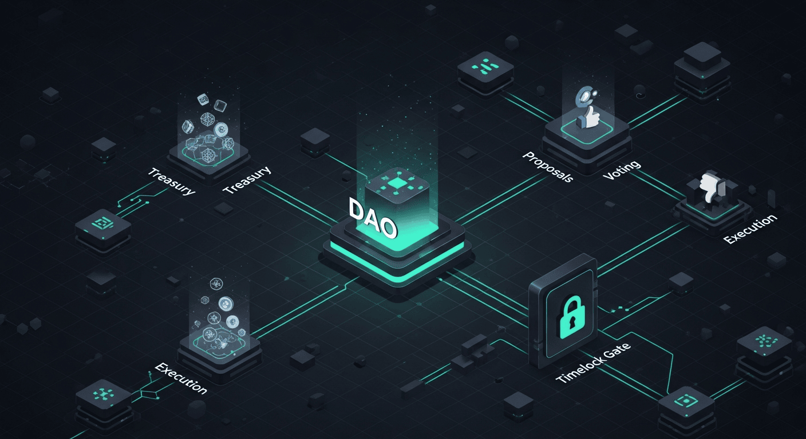

# DAO Governance Mechanism

## Overview
Docs-only case study of a DAO governance mechanism, documenting the proposal lifecycle, voting and delegation design, execution patterns (including timelocks), security mitigations, and operational governance practices.

## Start here
**[Open the Documentation Index](./docs/00-index.md)**

## Documentation
- [00 — Index](./docs/00-index.md)
- [01 — Governance Overview](./docs/01-governance-overview.md)
- [02 — Proposal Lifecycle](./docs/02-proposal-lifecycle.md)
- [03 — Voting & Delegation](./docs/03-voting-and-delegation.md)
- [04 — Execution & Timelocks](./docs/04-execution-and-timelocks.md)
- [05 — Security & Attack Mitigations](./docs/05-security-and-mitigations.md)
- [06 — Upgrades, Parameters & Governance Ops](./docs/06-upgrades-and-governance-ops.md)

## Notes
- No proprietary source code included.
- Relative links are used so everything opens correctly from the repo root.
